# 🛡️ SecuLearn - Siber Güvenlik Eğitim Oyunu

SecuLearn, "Siber Güvenliğe Giriş" dersi kapsamında ortaokul ve lise düzeyindeki öğrencilere temel güvenlik kavramlarını öğretmek amacıyla geliştirilmiş interaktif ve eğitici bir mobil oyundur. Bu proje, teorik bilgileri **oyunlaştırma (gamification)** teknikleriyle birleştirerek kalıcı öğrenmeyi hedefler.

🎮 Oyun Modülleri ve İçerik
Proje içerisinde siber güvenlik temellerini anlatan iki farklı eğitim modülü bulunmaktadır:

1. Siber Kelime Avı (Siber Sözlük): 
   * Phishing, Trojan, Firewall, Bütünlük, Gizlilik, Keylogger gibi temel siber güvenlik terimlerini "Adam Asmaca" mantığıyla öğretir.
   * Derse Uyumu: Gizlilik, Bütünlük ve Erişilebilirlik (CIA Triad) kavramlarının pekiştirilmesi.

2. Veri Yılanı (Data Snake): 
   * Oyuncunun bir "Veri Paketi"ni yöneterek zararlı yazılımlardan (duvarlar ve virüslü yemler) kaçtığı refleks tabanlı oyun.
   * *Derse Uyumu:* Ağ üzerindeki veri paketlerinin güvenli iletimi ve zararlı yazılımlardan (Malware) kaçınma mantığı.

🛠️ Kullanılan Teknolojiler
* Oyun Motoru: Unity 6 (2D)
* Programlama Dili: C#
* Arayüz (UI): TextMeshPro (TMP)
* Veri Tabanı & Kimlik Doğrulama: Google Firebase Authentication

🔐 Güvenlik ve Mimari Detayları
Bu proje sadece siber güvenliği öğretmekle kalmaz, aynı zamanda arka planda güvenli yazılım geliştirme prensiplerini de uygular:

* Şifreleme: Kullanıcı verileri yerel veritabanı yerine Firebase Authentication ile şifrelenerek (hash) bulut ortamında güvenle saklanmaktadır.
* Güçlü Parola Algoritması: Kayıt aşamasında özel olarak yazılan algoritma ile kullanıcıların en az 8 karakter, büyük/küçük harf ve rakam içeren şifreler oluşturması zorunlu tutulmuştur.
* Thread (İş Parçacığı) Yönetimi: Veritabanı sorguları sırasında oyunun donmasını engellemek için `Async/Task` yapısı kullanılarak asenkron veri çekme işlemi yapılmıştır.
* Optimizasyon: Oyun içi zaman kontrolü (`Time.timeScale`) ve etkili bellek yönetimi uygulanmıştır.

📸 Ekran Görüntüleri
<table align="center">
  <tr>
    <td>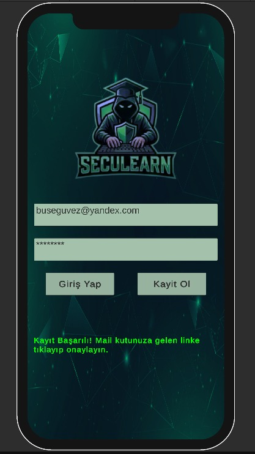</td>
    <td>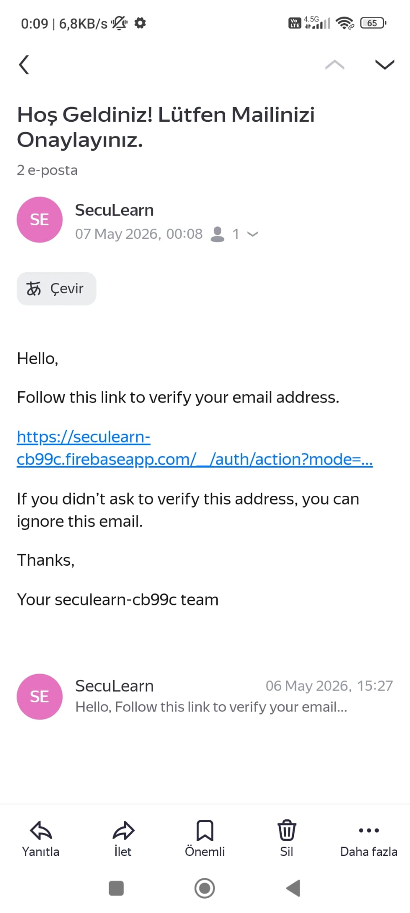</td>
    <td>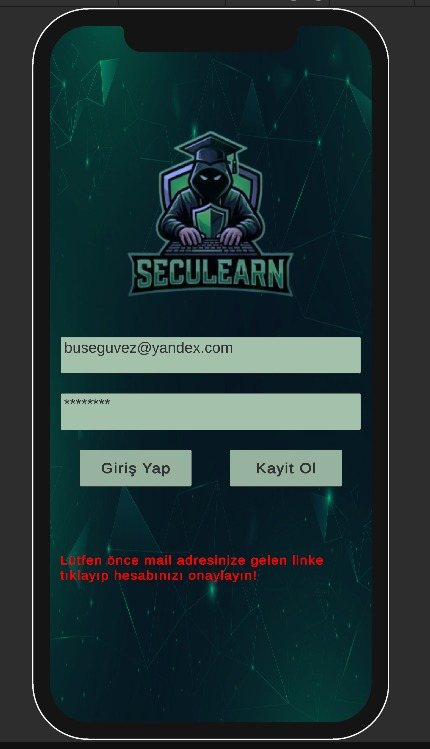</td>
   <td>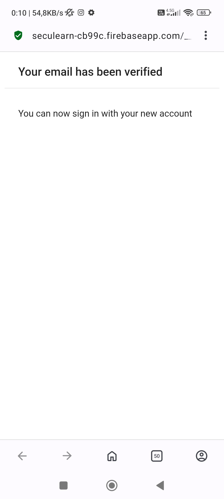</td>
  </tr>
  <tr>
   <td>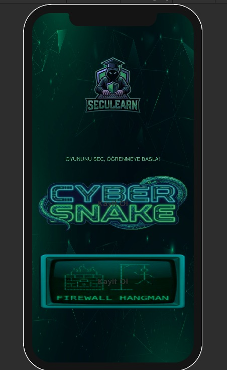</td>
    <td>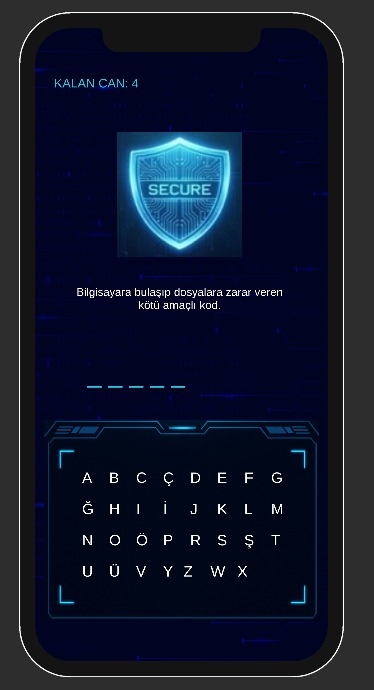</td>
    <td>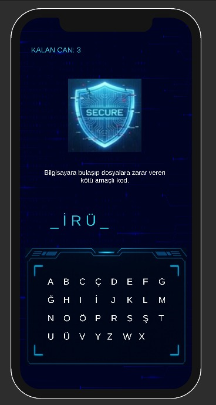</td>
    <td>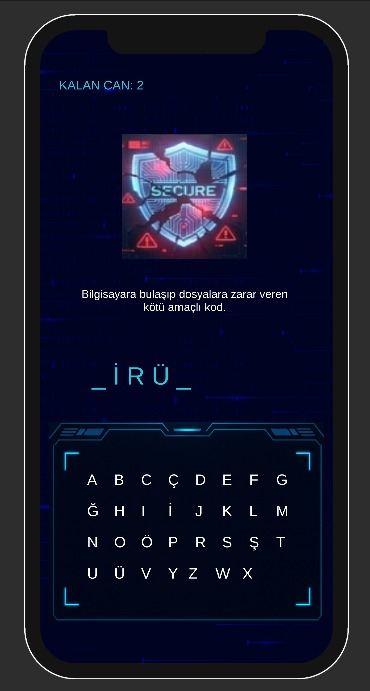</td>
  </tr>
 <tr>
   <td>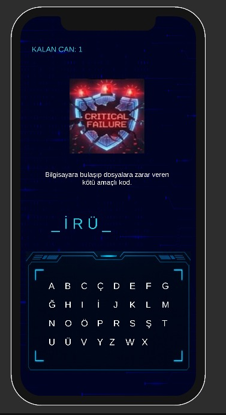</td>
    <td>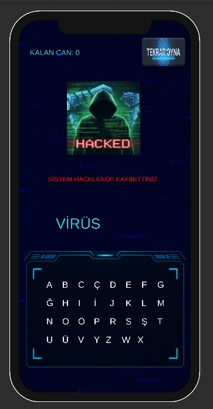</td>
    <td>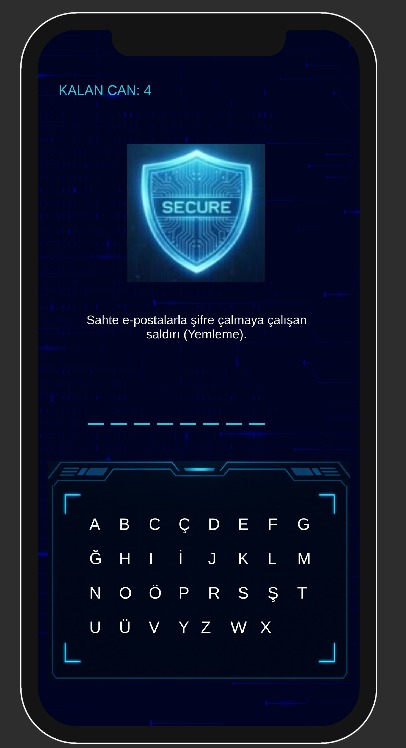</td>
    <td>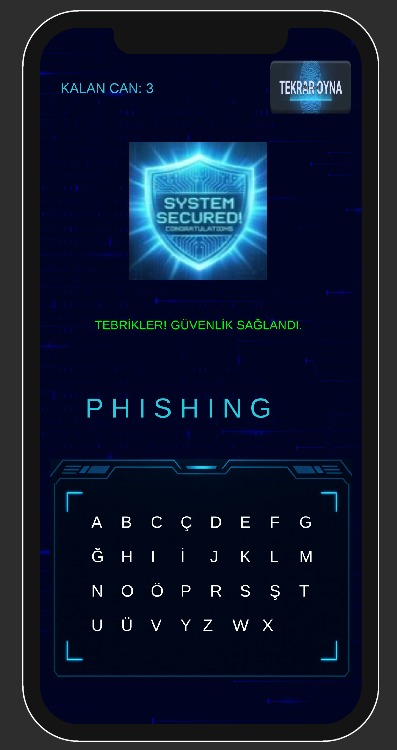</td>
  </tr>
 <tr>
   <td>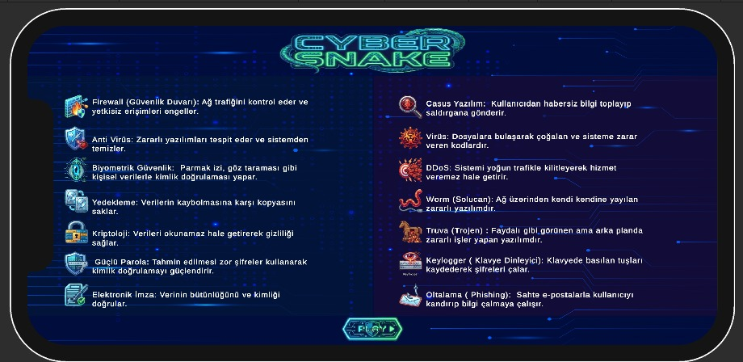</td>
    <td>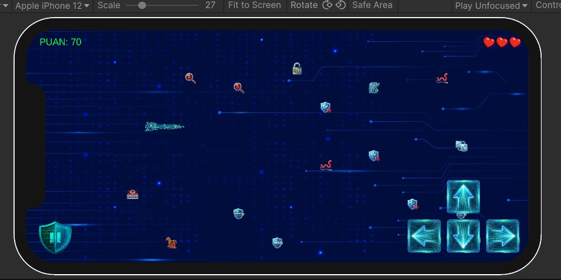</td>
    <td>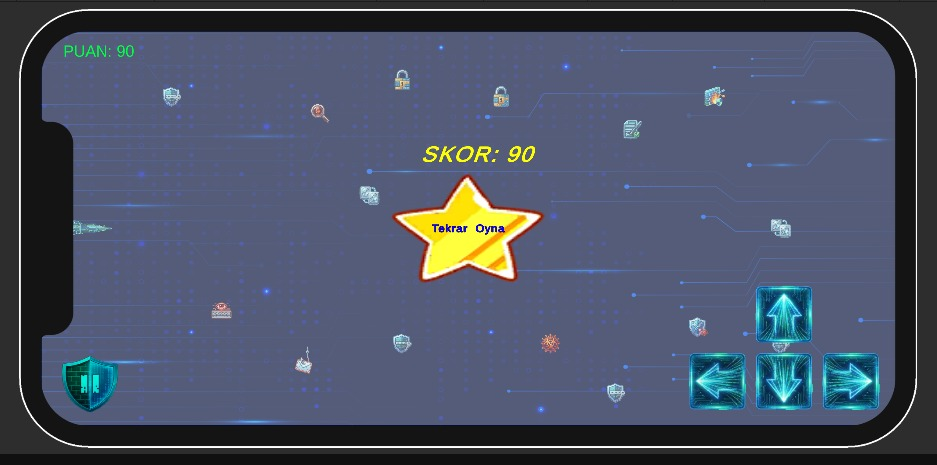</td>
     <td></td>
    
  </tr>
 
</table>
